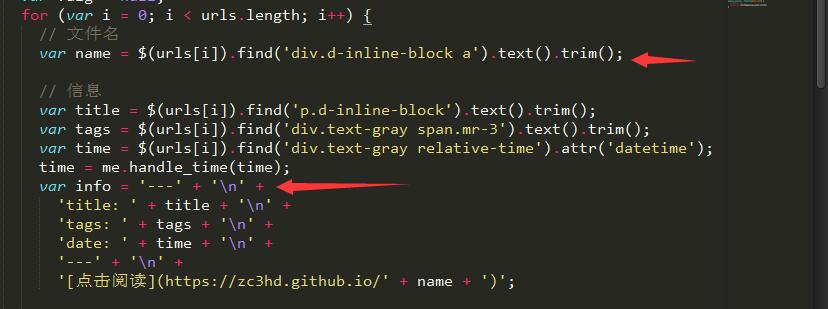
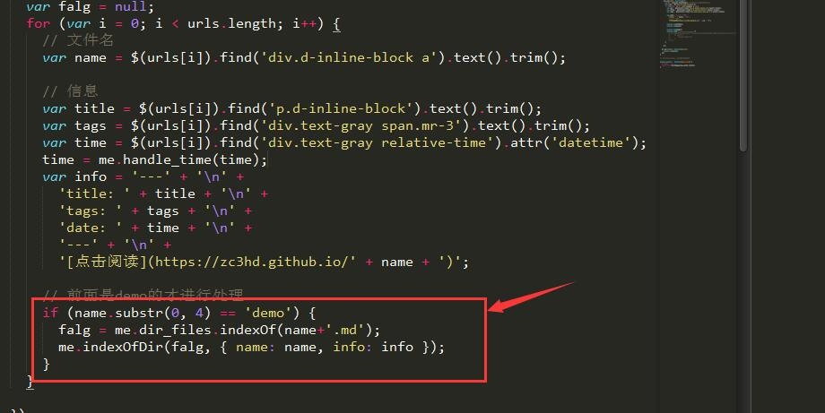
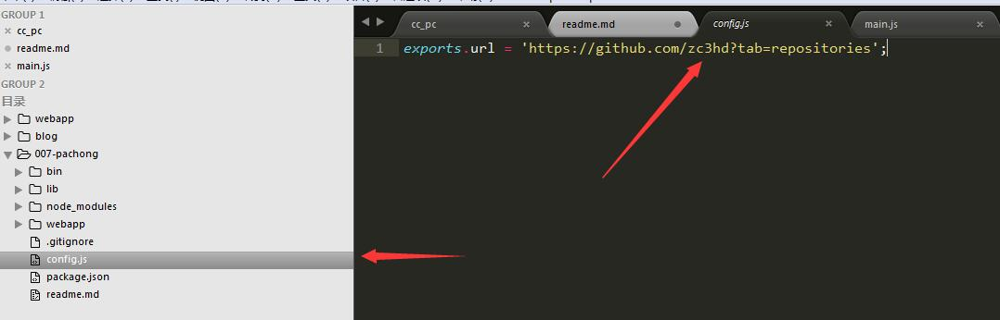
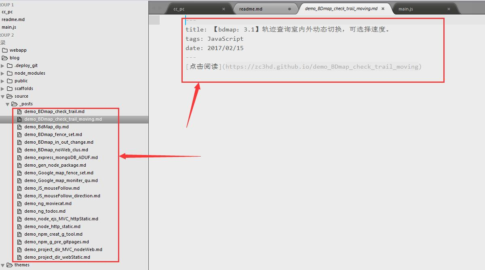

# npm -g 配合博客自动爬github上仓储自动生成我需要的md文件~c~

### 1.运行下载

*  git clone 本存储地址
* npm install
* 全局命令 cc-pac -i ./(相对路径或绝对路径)

### 2.特别注意

* 命令行输入绝对路径分隔符要注意为双反斜杠   \\

### 3.需三方包

* bluebird：promise的利器
* fs-extra：这里其实没有用这个包的拓展API，用习惯了就把这个也用上了。
* cheerio：读取到文件内容包装为一个大DOM，进行各种DOM的类JQ操作

### 4.爬虫思路

#### 4.1读取文件

* 路径那个地方提供两个参数，相对路径和绝对路径，为了加快文件的生成，也为了避免重复生成文件
* 首先读取指定路径下的文件信息，把读取到的信息挂载到全局变量上。

```
function fetchPage(argv_path) {
  this.path = argv_path;
  //设置全局变量
  this.dir_files = [];
}
---------------------------------------------------
init: function() {
    var me = this;

    me.read_dir()
      .then(function(arr) {
        //挂载到全局变量上
        me.dir_files = arr;
        console.log(arr);
        me.get_gitpages()
      })
},
```

#### 4.2读取github仓储

* 代码实现：

```
  get_gitpages: function() {
    /* body... */
    var me = this;
    return new Promise(function(resolve, reject) {
      http.get(config.url, function(res) {
        var html = ''; //用来存储请求网页的整个html内容
        res.setEncoding('utf-8'); //防止中文乱码

        res.on('data', function(chunk) {
          html += chunk;
        });

        res.on('end', function() {
          var $ = cheerio.load(html); //采用cheerio模块解析html
          var urls = $('div.js-repo-list>li');
          console.log('github库存信息读取成功--')

          var falg = null;
          for (var i = 0; i < urls.length; i++) {
            // 文件名
            var name = $(urls[i]).find('div.d-inline-block a').text().trim();

            // 信息
            var title = $(urls[i]).find('p.d-inline-block').text().trim();
            var tags = $(urls[i]).find('div.text-gray span.mr-3').text().trim();
            var time = $(urls[i]).find('div.text-gray relative-time').attr('datetime');
            time = me.handle_time(time);
            var info = '---' + '\n' +
              'title: ' + title + '\n' +
              'tags: ' + tags + '\n' +
              'date: ' + time + '\n' +
              '---' + '\n' +
              '[点击阅读](https://zc3hd.github.io/' + name + ')';

            // 前面是demo的才进行处理
            if (name.substr(0, 4) == 'demo') {
              falg = me.dir_files.indexOf(name+'.md');
              me.indexOfDir(falg, { name: name, info: info });
            }
          }

        });

      }).on('error', function(err) {
        reject(err);
      });
    });
  },
```

* 可以看到上面这个请求我用promise进行了包装。但是判断是否存在文件，和生成新的文件都在变量的里面执行了。这里我是遇到了坑。简单讲就是闭包。



* 本来我是要把收集到name(文件名)，info(文件内容)在循环的时候组成一个对象，推到一个数组中，我上面的获取指定路径下的文件信息也是promise包装的。我原来想着是用promise.all()方法收集两个异步回来的数据。这里有坑。收集数据和文件信息都没有问题。但是收集到仓储的数据就是最后一组数据多次重复。我开始以为是组对象的组装错误，后来发现是闭包的原因。因为我在循环遍历的时候，urls[i]的是一个对象，当遍历完成后，i成为length-1,所有的对象指向都是最后一个对象的数据。故resolve（组装好的数组），这个数组就全部是最后一组数据组成的大数组。
* 所以我需要在闭包内部就判断有没有在当前文件下就存在这个文件，及形成新的文件。而且生成文件这里是同步生成。



### 5.其他说明

* 包没有注册，但并不妨碍你使用。
* 这里有个配置文件，可以直接当别人写的所有的仓储，但是不能保证可以使用。需要自己改我的源码



* 为什么我的可以使用？因为我本地项目基本都有gh-pages的展示分支，而我的博客里面.md文件都是一个标题夹一个连接内容，其实这样自己感觉也对。我可以分开管理每个项目，又简单集成到博客上，然后每个项目的展示页都可以回到主页。所以这也就是我昨天写的那个自动生成gh-pages项目的全局的包的目的。
* 爬虫生成的目录和我博客里要的内容



* [自动生成gh-pages项目全局命令包的学习](https://zc3hd.github.io/demo_npm_g_pre_gitpages/)


